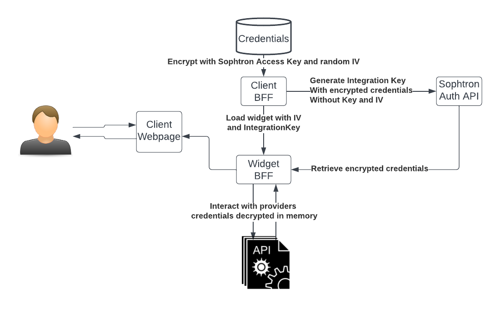

# Quick How-to

- Fill in the required credentials in [server/config.js](server/config.js)
  * NOTE: Please remember that secrets are passed through environment variables instead of hardcoded in the js file.
  * Sophtron credentials are required to for the Auth (provide authentication and secret exchange), storage (redis-like session cache) and analytics services
  * Data provider specific secrets are handled dynamically by integrating-party, the please see [the example](../example/README.md)
  * Generate `CryptoKey` and `CryptoIv` with command `npm run keys` and put into the config, this is for encrypting session token, in order no to rely on cookies, this key must be shared across server instances if there are multiple or auto-scaled
- For deployment, use `build.sh` to build the docker image and start it with needed `ENV`s
- For development
  * start react dev server by `npm run start`, this will serve client(browser) side code thorugh port `3000` but won't handle end-to-end development
  * start the bff server by `npm run server`, the service will be accessible at `http://localhost:8080`

Search and Auth components are currently using sophtron hosted service, we are working on opening those up. 
To integrate/embed a hosted instance of this project, please see [the example](../example/README.md)
- Auth flow explained: 
